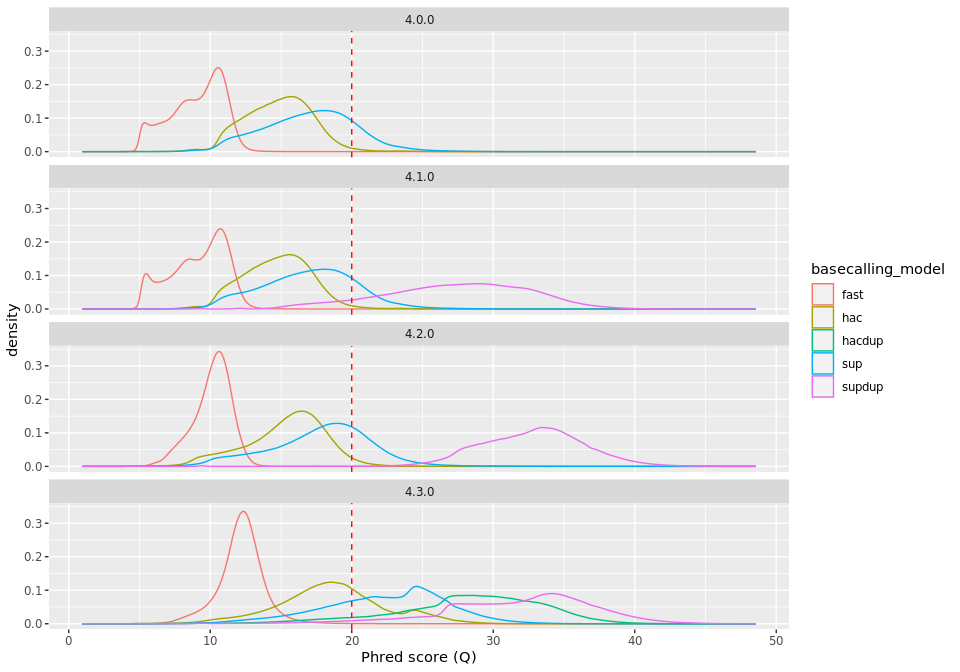

README
================
Rasmus Kirkegaard
25 February, 2023

# R10.4.1 Zymo HMW basecalling

With the release of R10.4.1 I wanted to check the quality of the raw
reads and the consensus accuracy to ensure that we had the right
approach for continuing our nanopore only assemblies from metagenomic
samples ([Mantas et
al. 2022](https://www.nature.com/articles/s41592-022-01539-7)). So we
sequenced the Zymo HMW mock DNA to evaluate the quality of the raw reads
but more importantly the assembled genomes. With the introduction of
[dorado](https://github.com/nanoporetech/dorado) as a basecaller that
should replace guppy it was also interesting to see how well that
performed.

## Aim

1.  Check if nanopore R10.4.1 is also capable of generating nanopore
    only assemblies.
2.  Evaluate the impact is of the different basecalling models on raw
    read accuracy
3.  Evaluate the impact is of the different basecalling models on
    consensus accuracy

## Conclusion

1.  Yes!!! The obtained indel and mismatch rates are very low already
    around 25X coverage. At \~0.1 /100 Kbp a 5 Mbp genome will have 5
    “errors” (Could still be the references at this point but likely
    does not matter) so it is unlikely to affect gene calling and most
    downstream analysis.
2.  There is a huge difference between fast, hac and sup for raw read
    accuracy. However, the time needed for compute is also much much
    higher for the super accuracy model.
3.  There seems to be a clear improvement in consensus accuracy by using
    super accuracy reads. Even providing higher coverage for fast or hac
    accuracy reads do not seem to fix this indicating that some of the
    errors fixed by sup(er accuracy) are indeed systematic errors in
    fast and hac. So super accuracy mode is the way to go if the aim is
    to generate reference quality genomes despite the additional need
    for GPU compute.

## Data availability

Uploading \>1TB fast5 files have turned out to be a complicated
challenge… seems like most of the guides for this were written in the
early MinION access program days and never updated as they still refer
to [fast5 files with basecalls included, albacore, and
metrichor](https://ena-docs.readthedocs.io/en/latest/submit/fileprep/reads.html#oxford-nanopore).
If someone has a good solution please let me know and I will be happy to
deposit the data.

## NP reads aligned to the refs

<!-- -->

## Indel rate vs coverage

<!-- -->

## Mismatch rate vs coverage

<!-- -->

## Materials and methods

Here is a brief description of the tools used. For the exact commands
check out the **Snakefile** in this repository
([Snakemake](https://snakemake.readthedocs.io/en/stable/) v. 7.18.2).

### DNA sequencing

DNA sample was the [Zymo Mock HMW
standard](https://zymoresearch.eu/products/zymobiomics-hmw-dna-standard).
The DNA was prepared for sequencing using the nanopore ligation
sequencing kit (SQK-LSK114) and sequenced on a R10.4.1 nanopore
promethion flowcell (FLO-PRO114M) with the “400 bp/s” mode (4khz
sampling).

### Basecalling

The reads were basecalled using
[dorado](https://github.com/nanoporetech/dorado) (v. 0.1.1) with fast,
hac and sup accuracy mode using the 4.0.0 models.

### Read QC

Reads were mapped to the updated zymo reference genomes (hopefully goes
public soon) using [minimap2](https://github.com/lh3/minimap2) (v.
2.24), and QC information was obtained using
[NanoPlot](https://github.com/wdecoster/NanoPlot) (v. 1.41.0).

### Assembly

The reads were subsampled using [seqtk](https://github.com/lh3/seqtk)
(v. 1.3) and assembled using [flye](https://github.com/fenderglass/Flye)
(v. 2.9.1). The metagenome assemblies were then polished using
[medaka](https://github.com/nanoporetech/medaka) (v. 1.7.2).

### Genome quality assessment

The assembled contigs were compared to the reference contigs using
[QUAST](https://github.com/ablab/quast) (v. 5.2.0) and
[fastANI](https://github.com/ParBLiSS/FastANI) (v. 1.33).
