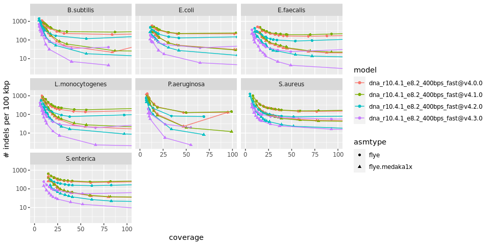
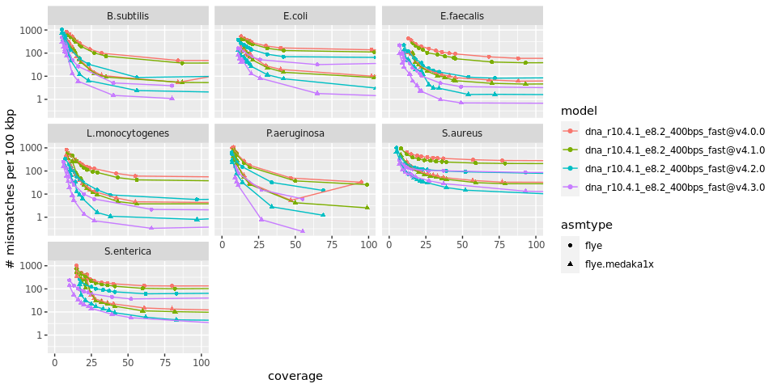
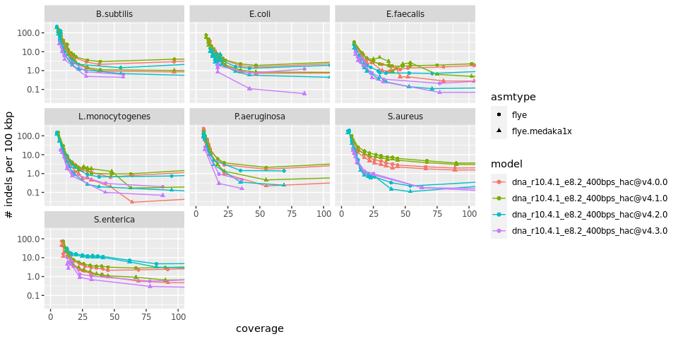
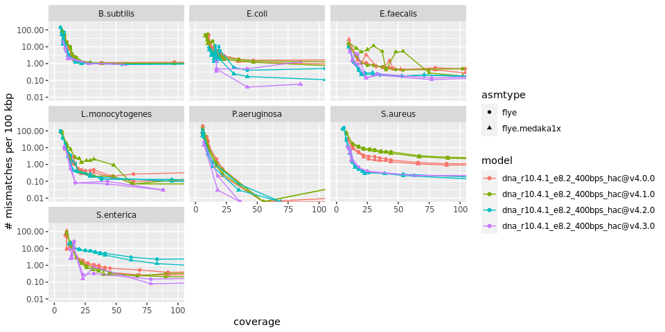
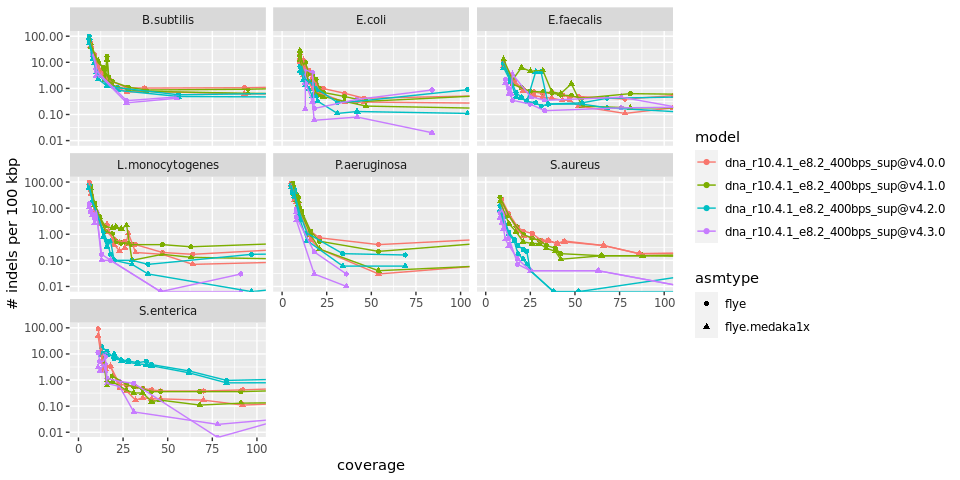
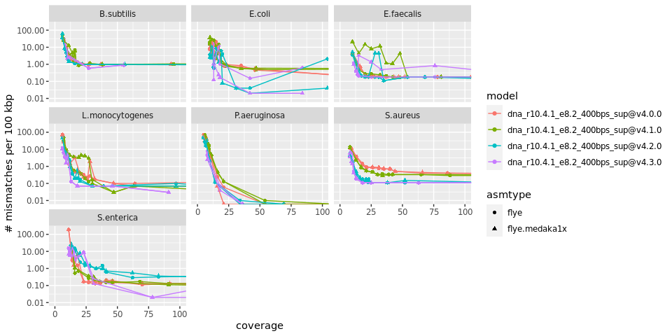

README
================
Rasmus Kirkegaard
20 December, 2023

# R10.4.1 Zymo HMW basecalling

With the release of R10.4.1 I wanted to check the quality of the raw
reads and the consensus accuracy to ensure that we had the right
approach for continuing our nanopore only assemblies from metagenomic
samples ([Mantas et
al. 2022](https://www.nature.com/articles/s41592-022-01539-7)). So we
sequenced the Zymo HMW mock DNA to evaluate the quality of the raw reads
but more importantly the assembled genomes. With the introduction of
[dorado](https://github.com/nanoporetech/dorado) as a basecaller that
should replace guppy it was also interesting to see how well that
performed.

## Aim

1.  Check if nanopore R10.4.1 is also capable of generating nanopore
    only assemblies.
2.  Evaluate the impact of the different basecalling models on raw read
    accuracy
3.  Evaluate the impact of the different basecalling models on consensus
    accuracy
4.  Evaluate if the introduction of 5khz sampling would allow for a move
    from SUP basecalling to HAC basecalling to speed up basecalling
5.  Check out duplex basecalling

## Conclusion

1.  Yes!!! The obtained indel and mismatch rates are very low already
    around 25X coverage. At \~0.1 /100 Kbp a 5 Mbp genome will have 5
    “errors” (Could still be the references at this point but likely
    does not matter) so it is unlikely to affect gene calling and most
    downstream analysis.
2.  There is a huge difference between fast, hac and sup for raw read
    accuracy. However, the time needed for compute is also much much
    higher for the super accuracy model.
3.  There seems to be a clear improvement in consensus accuracy by using
    super accuracy reads. Even providing higher coverage for fast or hac
    accuracy reads do not seem to fix this indicating that some of the
    errors fixed by sup(er accuracy) are indeed systematic errors in
    fast and hac. So super accuracy mode is the way to go if the aim is
    to generate reference quality genomes despite the additional need
    for GPU compute.
4.  HAC data shows a serious improvement on raw read accuracy compared
    to 4khz sampling. However, it is still inferior to the 4khz SUP data
    on this metric. For assemblies the consensus is on par with 4 khz
    sup for some organisms but generally slightly worse. For mismatches
    there is a similar pattern with some organisms being equally good
    and others where HAC is simply worse.
5.  Duplex reads really represent a step change in single read accuracy

## Data availability

### 4 khz data

The data has been added to the NCBI-SRA
[PRJNA934154](https://www.ncbi.nlm.nih.gov/bioproject/PRJNA934154). I
have managed to upload the fastq and the fast5 files. The fastq and
fast5 files should be available through the “cloud delivery service”.

Fastq data (fast,hac & Sup):
[SRR23563655](https://trace.ncbi.nlm.nih.gov/Traces/?view=run_browser&page_size=10&acc=SRR23563655&display=data-access)

Fast5 data:
[SRR23437037](https://trace.ncbi.nlm.nih.gov/Traces/?view=run_browser&acc=SRR23437037&display=data-access)

### 5 khz data

Fastq data: - fast:
[SRR24893246](https://trace.ncbi.nlm.nih.gov/Traces/?view=run_browser&page_size=10&acc=SRR24893246&display=data-access) -
hac:
[SRR24893245](https://trace.ncbi.nlm.nih.gov/Traces/?view=run_browser&page_size=10&acc=SRR24893245&display=data-access) -
sup:
[SRR24893244](https://trace.ncbi.nlm.nih.gov/Traces/?view=run_browser&page_size=10&acc=SRR24893244&display=data-access)

Pod5 data: The data has been added to the ENA
[PRJEB64570](https://www.ebi.ac.uk/ena/browser/view/PRJEB64570). (NCBI
did not accept pod5 and told me they do not want to do that)

### 5 khz high duplex data

The data has been added to the ENA
[PRJEB65462](https://www.ebi.ac.uk/ena/browser/view/PRJEB65462)

Fastq data: - sup:
[ERR11901474](https://www.ebi.ac.uk/ena/browser/view/ERR11901474) - sup
duplex:
[ERR11901475](https://www.ebi.ac.uk/ena/browser/view/ERR11901475)

Pod5 data: -
[ERR11924124](https://www.ebi.ac.uk/ena/browser/view/ERR11924124)

## NP reads mapped to the refs overall (percent identity)

<!-- -->

## NP reads mapped to the refs overall (phred scale)

Phred scores for perfect matching reads are calculated as recommended by
[Armin
Topfer](https://twitter.com/kirk3gaard/status/1397457000217423873) which
takes length into account.

<!-- -->

## NP reads aligned to the refs (98-100 % identity)

<!-- -->

## Indel rate vs coverage

<!-- -->

## Mismatch rate vs coverage

<!-- -->

## 4khz SUP vs 5 khz HAC & SUP

With the launch of 5 khz sampling rate around London Calling 2023 ONT
was hoping that the GPU power needed for basecalling could be decreased
dramatically as this should allow for the use of the faster HAC model to
replace the compute intensive SUP model at 4khz. To test this we here
compare the consensus assemblies with the 4 khz SUP model and the new
5khz HAC and SUP models.

### Indels

The indel rate seems to be higher with 5khz HAC than both SUP regardless
of sample rate. Interestingly the 5khz sample rate with SUP performs
much better than 4 khz SUP for some organisms but not S enterica.

<!-- -->

### Mismatches

While HAC is on par with SUP for some organisms it is never the best
option for mismatches.

<!-- -->

## Model 4.2 vs 4.3

### Indels

<!-- -->

### Mismatches

<!-- -->

## Materials and methods

Here is a brief description of the tools used. For the exact commands
check out the **Snakefile** in this repository
([Snakemake](https://snakemake.readthedocs.io/en/stable/) v. 7.18.2).

### DNA sequencing

DNA sample was the [Zymo Mock HMW
standard](https://zymoresearch.eu/products/zymobiomics-hmw-dna-standard).
The DNA was prepared for sequencing using the nanopore ligation
sequencing kit (SQK-LSK114) and sequenced on a R10.4.1 nanopore
promethion flowcell (FLO-PRO114M) with the “400 bp/s” mode (4khz
sampling). The DNA was prepared for sequencing using the nanopore
ligation sequencing kit (SQK-LSK114) and sequenced on a R10.4.1 nanopore
MinION flowcell (FLO-MIN114) with the “400 bp/s” mode (5khz sampling).
The DNA was prepared for sequencing using the nanopore ligation
sequencing kit (SQK-LSK114) and sequenced on a R10.4.1 nanopore
PromethION flowcell (FLO-PRO114HD) with the “400 bp/s” mode (5khz
sampling).

### Basecalling

#### 4 khz PromethION data

The reads were basecalled using
[dorado](https://github.com/nanoporetech/dorado) (v. 0.1.1) with fast,
hac and sup accuracy mode using the 4.0.0 and 4.1.0 models.

#### 5 khz MinION data

The reads were basecalled using
[dorado](https://github.com/nanoporetech/dorado) (v. 0.3.0) with fast,
hac and sup accuracy mode using the 4.2.0 models.

#### 5 khz High Duplex PromethION data

The reads were basecalled using
[dorado](https://github.com/nanoporetech/dorado) (v. 0.3.4) with fast,
hac and sup accuracy mode using the 4.2.0 models.

### Read QC

Reads were mapped to the updated zymo reference genomes (hopefully goes
public soon) using [minimap2](https://github.com/lh3/minimap2) (v.
2.24), and QC information was obtained using
[NanoPlot](https://github.com/wdecoster/NanoPlot) (v. 1.41.0).

### Assembly

The reads were subsampled using [seqtk](https://github.com/lh3/seqtk)
(v. 1.3) and assembled using [flye](https://github.com/fenderglass/Flye)
(v. 2.9.1). The metagenome assemblies were then polished using
[medaka](https://github.com/nanoporetech/medaka) (v. 1.8.0).

### Genome quality assessment

The assembled contigs were compared to the reference contigs using
[QUAST](https://github.com/ablab/quast) (v. 5.2.0) and
[fastANI](https://github.com/ParBLiSS/FastANI) (v. 1.33).
